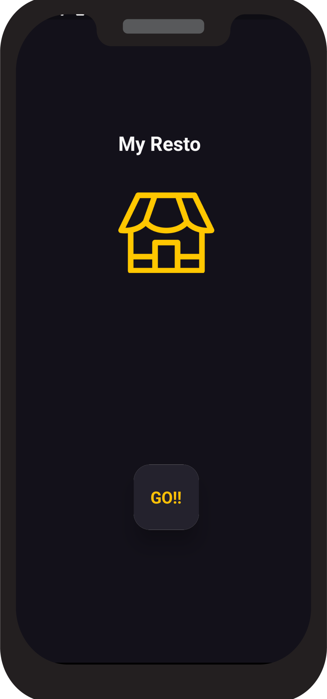
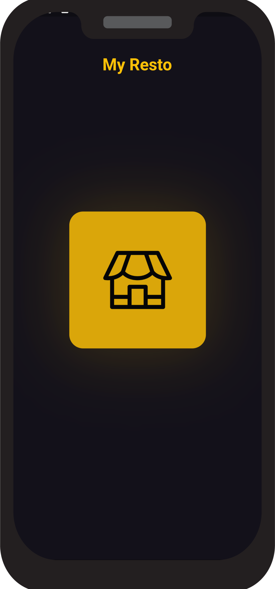
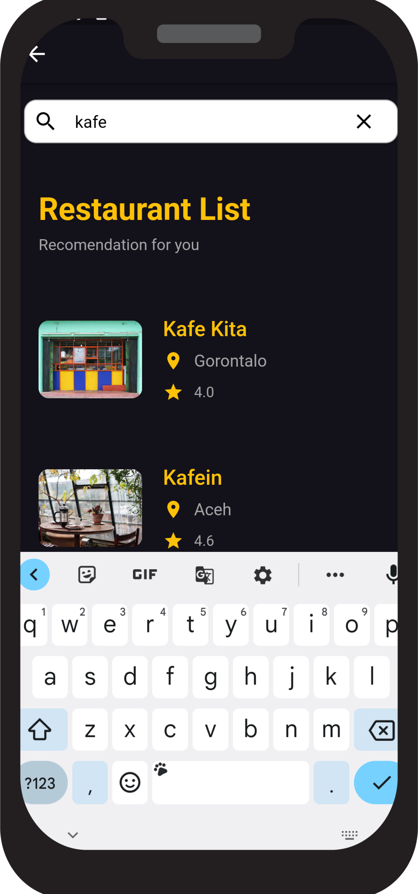

# Find Your Restaurant Application

```dart
class Revaldo extends Flutterchallenge {
    return {
      "title": "Flutter Find Your Restaurant Application",
      "description": "How to build an app using API and listview builder",
      "URL": "https://revaldo-356ae-default-rtdb.asia-southeast1.firebasedatabase.app/.json"
      "day": 3,
    }
}
```

- [Firebase URL](https://revaldo-356ae-default-rtdb.asia-southeast1.firebasedatabase.app/.json)

## Getting Started 🚀

```shell
- Clone the repo
- Install the dependicies
- Run it
```

## ScreenShot

&nbsp;&nbsp;

###### V1
&nbsp;


